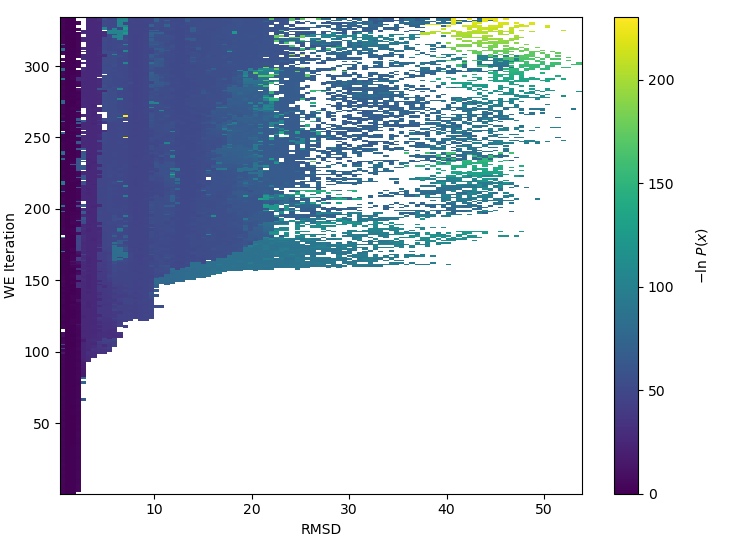
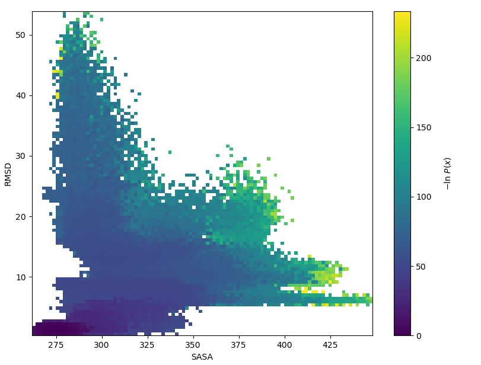

# How does a ligand exit from a buried receptor cavity? Atomistic simulations of unbinding pathways with rigorous kinetics
Marion L. Silvestrini *, Riccardo Solazzo *, Matteo Masetti, Kevin H. Gardner, Lillian T. Chong

## Abstract
Hypoxia-inducible factors (HIFs) are heterodimeric transcription factors that can promote cancer growth. The development of small-molecule drugs that can inhibit the formation of the dimer is therefore a promising route to the treatment of cancer. Here, we focus on the relevant domain of the protein, the HIF2α PAS-B domain, which contains a preformed, buried cavity that binds  artificial small-molecule ligands that allosterically perturb the formation of the HIF heterodimer.  We examine how a representative ligand (THS-017) dissociates and re-enters the buried cavity using atomistic simulations. To enable these simulations, we applied the weighted ensemble path sampling strategy, which can generate continuous pathways with rigorous kinetics (i.e., rate constants) in orders of magnitude less computing time compared to standard simulations. Results reveal a diverse set of pathways for both the ligand unbinding and rebinding processes with estimated rate constants and methyl order parameters that are consistent with experiment. 

Please click here to view representative pathway trajectories: 

### Copyright 

# Weighted Ensemble simulation of the HIF2alpha PAS-B ligand unbinding process

Authors: Gessica Adornato, Riccardo Solazzo

E-mail: gma57@pitt.edu, riccardo.solazzo@phys.chem.ethz.ch

## Introduction
The purpose of this notebook and the associated github repository is to demonstrate the simulation of the unbinding process of THS-017 from HIF2alpha using the Weighted Ensemble (WE) algorithm in WESTPA 2.0. By executing the provided code, users can replicate the results outlined in the associated publication (DOI: insert DOI).

There are three main steps included in this document: Conventional molecular dynamics, weighted ensemble, and analysis. This repository was designed for the user to start at whichever step they want. You can start at the beginning and create your own basis states, or if you want to jump straight to WE, the repo already contains sample basis states. There is also a sample .h5 output file for those who want to see how analysis was conducted without having to run their own WE simulation.

The recommended way to use this guide is to enter the commands directly into a LINUX terminal. Access to computational resources such as a HPC is also encouraged.

## Table of contents
- [Environment](#environment)
- [Step 1: Generating basis states](#step-1-generating-basis-states)
- [Step 2: Running WE](#step-2-running-we)
    - [Submitting jobs on HPC ](#submitting-jobs-on-hpc)
- [Step 3: Simulation analysis](#step-3-simulation-analysis)
    - [WEDAP](#wedap)
    - [Checking convergence to steady state](#checking-convergence-to-steady-state)
    - [Accelerating convergence to steady state](#accelerating-convergence-to-steady-state)

## Environment

First, make sure that all the required packages needed for running the simulations are properly installed.
In this work, we employed the AMBER MD engine, so in order to reproduce our simulation you will need a version of this software ready to run on GPU. Please refer to the AMBER website for instructions on installing AMBER in your particular computing environment.
In addition, the WESTPA package must be installed in your environment using pip:

~~~bash
# Create a conda environment for WESTPA
$ conda create -n westpa --yes python=3.9
# Activate the environment
$ conda activate westpa
# Install WESTPA through pip
$ pip install westpa
~~~

In order to run WESTPA in your computing environment, the environment must be set up by properly configuring the env.sh script. Please edit the included script according to your needs. Assistance with this, including examples for various computing environments, can be found on the WESTPA wiki: https://github.com/westpa/westpa/wiki.

## Step 1: Generating Basis States
Before running a WE simulation we need to generate basis states. To do that, we are going to run conventional MD simulations of the solvated ligand-bound HIF2alpha system. All the files needed for this process are in the modeling_eq_cMD folder. 

First, we use tleap to generate a solvated structure based on the ligand-bound crystal structure using the selected force fields (OPC/ff19sb). To do this, open the terminal in this folder and type the following command:

~~~bash
$ tleap -f tleap.in >tleap.out
~~~
Check the output file to ensure there were no errors in execution. This command should create three files: bound_new.inpcrd, bound_new.prmtop, and bound_new.pdb. Verify that the pdb file has the correct connectivity through a program such as vmd.

If everything looks good, then it is time to run the equilibration. This is best done on an HPC cluster using the run_equil.slurm script:
~~~bash
$ sbatch run_equil.slurm
~~~
This will automatically run through four equilibration steps: minimization, heating, pressurizing, and equilibration. When they are finished, check the output to be sure it ran correctly. There should be 4 new folders in the directory with a .nc, .nfo, .out, and .rst in each.

Next, edit run.slurm to your specifications. prodmanager.sh will use this script to run five 100 ns production runs automatically:
~~~bash
$ bash prodmanager.sh
~~~
The production runs may take a day or two to complete. When they are done, run getbstates.sh to extract the last 5 frames of each run:
~~~bash
$ bash getbstates.sh
~~~
Five basis states can then be chosen from the 25 options generated by the script (five for each run). One way to do this would be using a random number generator to produce five random numbers between 1 and 25, where 1-5 would be from folder 1, 6-10 would be from folder 2, etc. Place the selected basis states in the /.../we_simulations/bstates folder, renaming each as bstate.ncrst. The associated pcoord.init file will be generated when the simulation initializes.

To run a new weighted ensemble simulation using your equilibration, you will need to move the bound_new.prmtop file to the we_simulations/common_files folder. You will also need to make a new reference.pdb file by running traj.in:
~~~bash
$ cpptraj traj.in
~~~
Move the reference.pdb file produced into the we_simulations/common_files folder as well.

At this point, you are ready to run a new WE simulation!

## Step 2: Running WE
For this section you can either use the set of files derived using step 1, or use the files in the we_simulations folder as-is.

#### Submitting jobs on HPC
In order to run the simulation on a cluster (recommended), the runwe2.slurm script should be modified according to the available computational resources. Then, the simulation can be started by running the following command from the we_simulations folder:

~~~bash
$ sbatch runwe2.slurm
~~~

Remember to comment out the line sourcing init.sh when continuing a paused simulation.

The following is an easy way to check the status of an ongoing simulation:

~~~bash
$ tail -n 50 west.log
~~~

It is recommended to monitor the simulation every 50-100 iterations for convergence using the tools detailed in the next section.

## Step 3: Simulation Analysis

### WEDAP
To get an idea of the amount of configurational space explored so far, it can be useful to visualize the probability distribution of your data. To do so, we will use wedap a library written by Darian Yang. Type the following in the terminal to install WEDAP:

~~~bash
# Install WEDAP in your conda environment
$ pip install wedap
~~~

The following code will allow us to visualize the 2D probability distribution of a single component of the multidimensional progress coordinate. The three components that form the progress coordinate are 1) solvent accessible surface area (SASA), 2) root mean squared deviation (RMSD), and 3) distance between the ligand and the protein. The specific progress coordinate can be specified by using the argument Xindex=i, where SASA, RMSD, and distance are 0, 1, and 2, respectively. The points in the graph are colored according to the negative logarithm of the weight.

For example, the following code will generate a probability distribution for the RMSD of a sample simulation after a little over 300 iterations:

~~~python
#Import WEDAP to calculate the 2D probability distributions and visualize the results.
import matplotlib.pyplot as plt
import numpy as np  
import wedap

wedap.H5_Plot(h5="west.h5", data_type="evolution", Xname='pcoord', Xindex=1).plot()
plt.xlabel("RMSD")
plt.ylabel("WE Iteration")
plt.show()
~~~

It can be useful to plot different dimensions of the progress coordinate against each other. In this way, you can get an idea of the correlation between two fundamental events of the unbinding mechanism of THS-017. For example, plotting SASA against RMSD can reveal the correlation between the opening of the buried pocket and the detachment of the ligand from the protein. This can be accomplished by running the following code. The figure shows results from a sample simulation after just over 300 iterations.

~~~python
import matplotlib.pyplot as plt
import numpy as np  
import wedap

wedap.H5_Plot(h5="west.h5", data_type="average", Xname='pcoord', Xindex=0, Yname='pcoord', Yindex=1).plot()
plt.xlabel("SASA")
plt.ylabel("RMSD")
plt.show()
~~~

### Checking convergence to steady state
A WE simulation is converged when it relaxes to a steady state flux. In order to visualize the flux as a function of the molecular time, we will need to run the w_ipa command:

~~~bash
$ w_ipa -ra
~~~

This command creates a folder called ANALYSISi1000. This folder contains a file called direct.h5, which will contain the information needed to visualize the conditional probability fulx.

Finally we can plot the results using the following script:

~~~python
import numpy as np
import matplotlib.pyplot as plt
import h5py

direct = h5py.File('direct.h5', 'r')

flux_A=direct['conditional_flux_evolution'][:,0,1]['expected']/1e-10

plt.plot(flux_A)
plt.xlabel('WE iteration')
plt.ylabel('k$_{off}$ ($s^{-1}$)')
plt.yscale('log')
plt.show()
~~~

### Accelerating convergence to steady state

Obtaining steady state distributions using weighted ensemble can be very time consuming for a complex process like protein-ligand unbinding. In these cases, it can be useful to redistribute the weights using the Weighted Ensemble Steady State plugin (WESS). This is appropriate when the flux has been constant for at least 100 iterations. To implement WESS reweighting, use the following steps:

1. Open the west.cfg file.
2. Replace the word 'false' with the word 'true' in lines 88 and 89, in the WESS plugin section.
3. Set the value of 'max_total_iterations' (line 60 of west.cfg) TWO GREATER THAN the current number of iterations. E.g., if the simulation just finished iteration 400, set max_total_iterations to 402.
4. Run a weighted ensemble simulation.
5. Replace the word 'true' with the word 'false' in lines 88 and 89 and set max_total_iterations to run for an additional 50-100 iterations.
6. Run 50-100 WE iterations with adjusted weights to relax the system to steady state.
7. Repeat steps 2 to 6 until the simulation converges.

